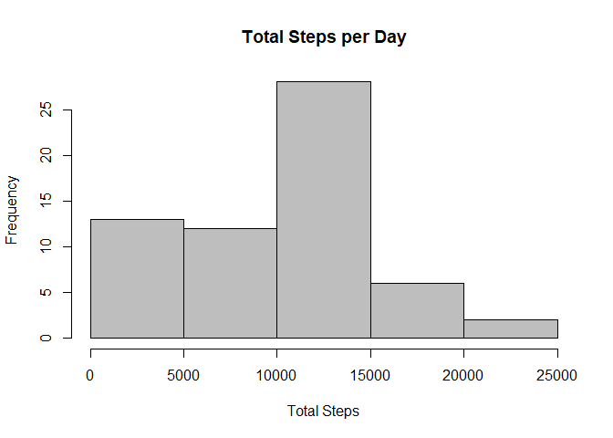
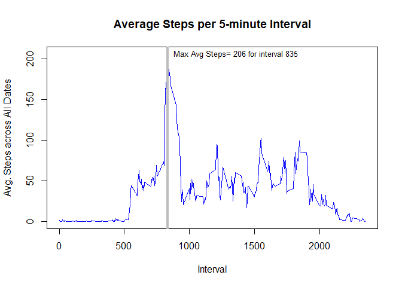
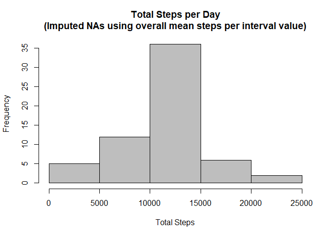
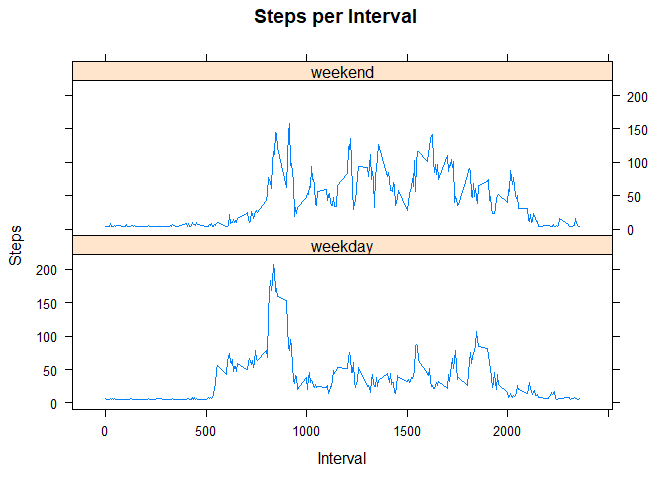

## Loading and preprocessing the data

Data loaded from activity.zip file. Set source file location to the project folder (using the sourcepath param in the YAML header). Original data source from course link: https://d396qusza40orc.cloudfront.net/repdata%2Fdata%2Factivity.zip  

```r
#Load required packages

library(readr)
library(dplyr)
library(tidyr)

#set vars
filename<-params$sourcepath
cols<-list(col_integer(),col_date(format=""),col_integer())
doPlot<-FALSE

#read data
activity<-read_csv(filename, col_types=cols)                 
nrows<-nrow(activity)

if(nrows>0) {
        doPlot<-TRUE
        knitr::kable(summary(activity), caption ="**Summary of activity.zip dataset**")
}
```


Table: **Summary of activity.zip dataset**

         steps             date               interval    
---  ---------------  -------------------  ---------------
     Min.   :  0.00   Min.   :2012-10-01   Min.   :   0.0 
     1st Qu.:  0.00   1st Qu.:2012-10-16   1st Qu.: 588.8 
     Median :  0.00   Median :2012-10-31   Median :1177.5 
     Mean   : 37.38   Mean   :2012-10-31   Mean   :1177.5 
     3rd Qu.: 12.00   3rd Qu.:2012-11-15   3rd Qu.:1766.2 
     Max.   :806.00   Max.   :2012-11-30   Max.   :2355.0 
     NA's   :2304     NA                   NA             


## What is mean total number of steps taken per day?  

```r
#1 Mean steps taken per day
steps_per_day<-plyr::ddply(activity,"date",plyr::summarise,total.steps=sum(steps, na.rm=TRUE))

meanSteps<-prettyNum(round(mean(steps_per_day$total.steps, na.rm=TRUE),0),big.mark=",")
medianSteps<-prettyNum(median(steps_per_day$total.steps, na.rm=TRUE),big.mark=",")

hist(steps_per_day$total.steps,main="Total Steps per Day",col="gray",xlab="Total Steps",ylab="Frequency")
```

<div class="figure">

<p class="caption">*Figure 1. Histogram of the total number of steps taken each day*  </p>
</div>

The **mean** total number of steps taken per day is: **9,354** and the **median** is: **10,395**    

Note for this plot and calculated values, NAs were removed from the dataset.  


## What is the average daily activity pattern?

```r
#2 Mean steps per interval
steps_per_intval<-plyr::ddply(activity,"interval",plyr::summarise,avg.steps=mean(steps, na.rm=TRUE)) %>% mutate(avg.steps=round(avg.steps,1))
maxIntval<-steps_per_intval[which.max(steps_per_intval$avg.steps),1]
maxSteps<-round(max(steps_per_intval$avg.steps),0)

plot(steps_per_intval,type="l",main="Average Steps per 5-minute Interval",col="blue",lwd=1,xlab="Interval",ylab="Avg. Steps across All Dates")
abline(v=maxIntval,lwd=4,col="gray")
text(maxIntval,maxSteps,paste("Max Avg Steps=",maxSteps,"for interval",maxIntval),pos=4,cex=.8)
```

<div class="figure">

<p class="caption">*Figure 2. Time series plot of the average number of steps taken  *</p>
</div>

The 5-minute interval **835** shows the maximum mean number of steps **206** (averaged across all the days in the dataset).
  

## Imputing missing values

```r
#3 Imputing NAs
#Rows with NA values
rowsNA<-prettyNum(nrow(activity)-sum(complete.cases(activity)),big.mark=",")

meanStepsInt<-round(mean(steps_per_intval$avg.steps,na.rm=TRUE),0) 

activity_full<-mutate(activity,steps=replace_na(steps,meanStepsInt))

rowsNA2<-prettyNum(nrow(activity_full)-sum(complete.cases(activity_full)),big.mark=",")
steps_per_day2<-plyr::ddply(activity_full,"date",plyr::summarise,total.steps=sum(steps, na.rm=FALSE))

meanSteps2<-prettyNum(round(mean(steps_per_day2$total.steps, na.rm=TRUE),0),big.mark=",")
medianSteps2<-prettyNum(round(median(steps_per_day2$total.steps, na.rm=TRUE),0),big.mark=",")

hist(steps_per_day2$total.steps,main="Total Steps per Day\n(Imputed NAs using overall mean steps per interval value)",col="gray",xlab="Total Steps",ylab="Frequency")
```

<div class="figure">

<p class="caption">*Figure 3. Histogram of total number of steps taken each day -  imputed missing values*  </p>
</div>

In Figure 3 above, the histogram is based on the activity dataset with NAs replaced with imputed values. Imputed values for NAs are based on the overall mean steps per interval: **37**  


The result shows the data more centered around the mean. 

The total number of rows containing missing values in the dataset is: **2,304**  

For the dataset with imputed missing values, the mean total number of steps taken per day is: **10,752** and the median is: **10,656**  

The impact of using the imputed missing data is to increase both the mean and median values.  


## Are there differences in activity patterns between weekdays and weekends?

```r
#4 Difference between weekdays and weekends

library(lattice)
activity_full<-mutate(activity_full,
                      dow=(ifelse(weekdays(activity_full$date) %in% list("Saturday","Sunday"), "weekend","weekday")),dow=factor(dow))

steps_per_intval2<-plyr::ddply(activity_full,c("dow","interval"),plyr::summarise,avg.steps=mean(steps, na.rm=TRUE)) %>% mutate(avg.steps=round(avg.steps,1))

p<-xyplot(steps_per_intval2$avg.steps ~ steps_per_intval2$interval | steps_per_intval2$dow, type="l",layout = c(1, 2),xlab="Interval",ylab="Steps",main="Steps per Interval") ## Plot with 2 panels

print(p)
```

<div class="figure">

<p class="caption">*Figure 4. Panel plots of time series - imputed missing values*  </p>
</div>


The plot above shows the average steps per interval averaged over all days in the datset. This dataset has been altered from the original data whereby null values for the steps variable have been replaced with the steps per interval (37) averaged overall all days.

The main pattern shown in the plot is that on weekends the higher (on average) number of steps for intervals starting around 1000. For intervals less than 100, the higher higher step counts appear for weekdays.  


